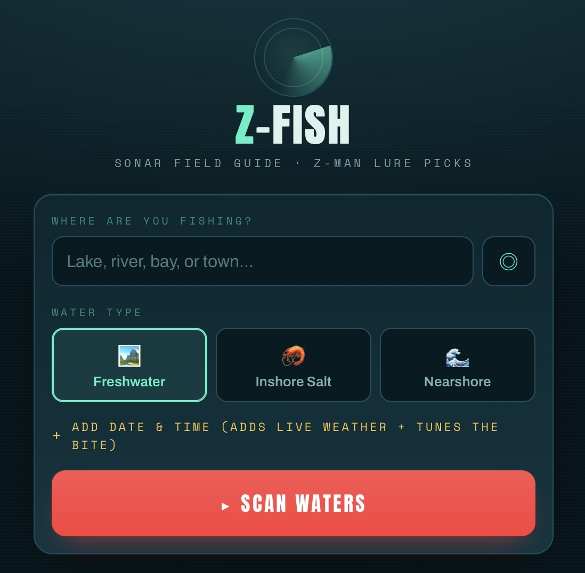

# 🎣 Z-Fish

**Sonar Field Guide — Z-Man Lure Picks**

Z-Fish is a mobile-first fishing companion. Tell it *where* you’re fishing (and optionally *when*), and it tells you what species are actually being caught there, how to catch them, and which **Z-Man** lures to throw given the live conditions on the water.

### 🔗 Live demo → **[davidfliesen.github.io/z-fish](https://davidfliesen.github.io/z-fish)**

### 🗺️ Architecture (v001) → **[davidfliesen.github.io/z-fish/architecture-001.html](https://davidfliesen.github.io/z-fish/architecture-001.html)**


<p align="center">
  <a href="https://davidfliesen.github.io/z-fish">
    
  </a>
</p>

-----

## What it does

- **Find your exact spot** — search a lake, river, ramp, or address (OpenStreetMap), drop a pin on the map for places that aren’t named, paste raw `lat, lon`, or use GPS.
- **See what’s really there** — species come from real iNaturalist observation records near your coordinates, with photos, ranked by how active they should be.
- **Get the how-to + Z-Man picks** — each fish gets a short how-to-catch brief and matched **Z-Man** lures with suggested colors and a reason for the choice.
- **Add a date & time** — Z-Fish pulls live weather and computes a bite window (falling pressure ahead of a front = prime; post-front bluebird high = tough; low-light windows get their due).
- **Works worldwide** — fish outside the curated North American set are matched to a Z-Man lure *type* by feeding style, so a pike in Sweden or a barramundi in Australia still gets a recommendation.
- **Knows when there’s no water** — a dry-land pin returns “no fishing waters found” instead of inventing fish.
- **New From Z-Man** — a feed of the latest products with thumbnails that link to Z-Man’s site.

It installs to the iOS/Android home screen as a PWA, so it behaves like a native app once added.

-----

## How it works

Z-Fish is a **static site** — a single `index.html` plus JSON data, hosted free on GitHub Pages. There’s no server to run or maintain, and every service it calls is free and key-free.

|Layer              |Implementation                                                                         |
|-------------------|---------------------------------------------------------------------------------------|
|Location search    |OpenStreetMap / **Photon** — type-ahead for ramps, lakes, addresses, with regional bias|
|Pin-drop & map     |**Leaflet** + free OpenStreetMap tiles                                                 |
|Weather            |**Open-Meteo** forecast — temp, wind, cloud, precipitation, surface pressure (16-day)  |
|Bite window        |Rules engine over time-of-day, cloud, wind, and pressure trend                         |
|Species by location|**iNaturalist** observation records near the coordinates, with real photos             |
|Global coverage    |Angling-archetype system keyed on genus → Z-Man lure *types*                           |
|No-water detection |OpenStreetMap / **Overpass** check for nearby lake / river / reservoir                 |
|Data (“database”)  |Version-controlled **JSON** files (`species`, `lures`, `new-products`)                 |
|Lure matching      |On-device rules engine over the Z-Man catalog                                          |
|Install            |Web App Manifest + Apple touch meta tags (PWA)                                         |

The data layer is documented in [`SCHEMA.md`](SCHEMA.md) and is structured to lift cleanly into SQLite/Postgres later.

-----

## Repo layout

```
z-fish/
├── index.html              ← the app
├── data/
│   ├── species.json        ← curated species + lure mappings
│   ├── lures.json          ← Z-Man catalog
│   └── new-products.json   ← "New From Z-Man" feed
├── architecture-001.html   ← system schematic
├── SCHEMA.md               ← data model
├── z-fish-preview.jpeg
└── README.md
```

The app loads its JSON over the web, so test on the live GitHub Pages URL (opening the file directly from disk won’t load the data).

-----

## Roadmap

- [x] Mobile-first prototype with live weather + bite window
- [x] JSON data layer (the “database”) + schema
- [x] Precise location: OSM search, map pin-drop, GPS
- [x] Real species by coordinates via iNaturalist, with photos
- [x] Global coverage via angling archetypes
- [x] No-water detection (Overpass)
- [x] *New From Z-Man* with thumbnails + links
- [ ] Vector-based lure matching (catalog embeddings precomputed once, searched in-browser)
- [ ] Optional AI-written tips (small serverless function to hold the key + an LLM)
- [ ] Automated new-product monitor
- [ ] Native apps (Expo / React Native) for the App Store & Google Play

-----

## Free to run

Everything Z-Fish uses today is free and requires no API key:

- **Open-Meteo** — weather & geocoding
- **OpenStreetMap / Photon** — location search & pin-drop
- **OpenStreetMap / Overpass** — water detection
- **iNaturalist** — species records & photos
- **Leaflet** + OpenStreetMap tiles — map

*Planned:* sentence-transformers + FAISS embeddings (precomputed, searched in the browser) and an optional Llama 3.3 model via Groq for written tips.

-----

## Disclaimer

Z-Fish recommends **Z-Man** products simply because they’re the lures the developer personally prefers and fishes with — **not** because of any sponsorship or paid relationship. This is an independent, unofficial project and is **not affiliated with, endorsed by, or sponsored by Z-Man Fishing Products** in any way. *Z-Man®*, *ChatterBait®*, *ElaZtech®*, and all related product names are trademarks of their respective owner and are referenced here for identification and educational purposes only. Always check local regulations, licenses, and conditions before fishing.

-----

## 👤 About the Developer

**David Fliesen** — *Hybrid Generative AI & Multimedia Developer* and founder of **Cibola Studios** (Summerville, SC).

A U.S. Navy Combat Camera veteran with 20+ years across photography, video, voice-over, and character animation, David has worked on DoD simulation and virtual-agent projects and completed the **Purdue / Simplilearn Applied Generative AI Specialization**. He builds practical, AI-powered applications through an iterative, prototype-first workflow — Z-Fish being a recent example of pairing free tooling with real-world utility.

### Connect

- 🌐 **Portfolio:** [davidfliesen.github.io](https://davidfliesen.github.io)
- 💼 **LinkedIn:** [linkedin.com/in/fliesen](https://www.linkedin.com/in/fliesen/)
- 🐙 **GitHub:** [github.com/DavidFliesen](https://github.com/DavidFliesen)

-----

<p align="center"><sub>Built with 🎣 by David Fliesen · Cibola Studios · Tight lines.</sub></p>